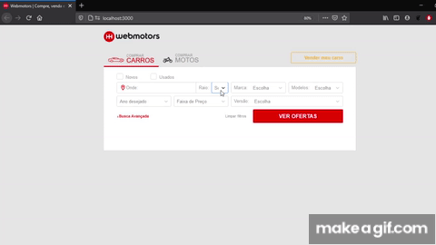

<h1 align="center">
    
</h1>

<h1>
  
</h1>

# Índice

- [Sobre](#-sobre)
- [Tecnologias utilizadas](#-tecnologias-utilizadas)
- [Como baixar o projeto](#-como-baixar-o-projeto)

## 📑 Sobre

Uma aplicação para venda de carros, baseada na antiga interface de procura da **WebMotors**.

## 💾 Tecnologias utilizadas

- [ReactJS](https://pt-br.reactjs.org/)
- [React-Select](https://react-select.com/home)
- [Axios](https://blog.rocketseat.com.br/axios-um-cliente-http-full-stack/)

## 📁 Como baixar o projeto

```bash
# Clonar o repositório
$ git clone https://github.com/gabrieltanaca/WebMotors.git

# Entrar no diretório
$ cd WebMotors

# Instalar dependências
$ yarn install

# Iniciar Projeto
$ yarn start

```
